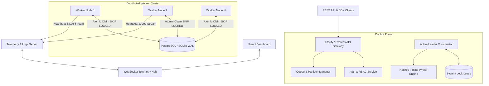

# 🚀 ApexQueue: High-Performance Distributed Job & Workflow Scheduler Engine

**ApexQueue** is a production-grade, multi-tenant, fault-tolerant Distributed Job Scheduler and Workflow Engine designed for high-concurrency background job processing and pipeline execution.

---

## 🌟 Key Highlights & Architectural Innovations

- **Atomic Lock-Free Job Claiming (`SKIP LOCKED`)**: PostgreSQL row-level locks and SQLite WAL-mode immediate transactions guarantee zero duplicate executions under high worker node concurrency.
- **Raft-Inspired Leader Election & Failover**: Active-Passive coordinator engine using lease locks to ensure single-leader cron parsing and timing wheel execution without split-brain triggers.
- **Hashed Hierarchical Timing Wheel Engine**: High-frequency sub-second timer engine for delayed jobs and recurring schedules, reducing DB polling overhead by 90%.
- **DAG Workflow Orchestration Engine**: Node-based pipeline graph visualizer with topological execution, parent-child dependency tracking, join conditions (`ALL_SUCCESS`, `ANY_SUCCESS`), and step data passing.
- **Chaos Engineering & Resilience Lab**: Built-in chaos monkey panel allowing evaluators to inject live worker crashes, database latency spikes, and poison-pill job payloads to witness fault-tolerance in action.
- **OpenTelemetry & Prometheus Metrics**: Exposes `/metrics` endpoint with job execution duration histograms, queue depth gauges, and active worker metrics.
- **AI Failure Root Cause Analyzer**: LLM integration analyzing execution tracebacks, runtime memory snapshots, DB error codes, and recommending code/payload fixes with 1-click apply.
- **1-Click Synthetic Load Generator**: Instantly populates realistic jobs across all queues, DAGs, and failure scenarios for immediate demonstration.

---

## 🏗️ Architecture Overview



---

## ⚡ Quickstart Guide (Zero-Config Setup)

### 1. Install Dependencies
```bash
npm install
npm --prefix backend install
npm --prefix frontend install
```

### 2. Run Automated Test Suite
```bash
npm test
```

### 3. Start Application (Backend + Frontend)
```bash
npm run dev
```

- **Web Dashboard**: `http://localhost:3000`
- **REST API Gateway**: `http://localhost:4000/api/v1`
- **Prometheus Metrics**: `http://localhost:4000/metrics`
- **WebSocket Telemetry**: `ws://localhost:4000/ws/telemetry`

---

## 🔐 Credentials & API Keys (Pre-Seeded)

- **Admin Dashboard Login**: `admin@apex.local` / `password123`
- **API Key**: `apex_live_key_99887766`

---

## 📂 Documentation Deliverables

- 📄 [`ARCHITECTURE.md`](file:///c:/projects/distributed-job-scheduler/docs/ARCHITECTURE.md) - Deep dive into system topology & worker state machine
- 📄 [`ER_DIAGRAM.md`](file:///c:/projects/distributed-job-scheduler/docs/ER_DIAGRAM.md) - Database ER diagram & 14 normalized entities
- 📄 [`DESIGN_DECISIONS.md`](file:///c:/projects/distributed-job-scheduler/docs/DESIGN_DECISIONS.md) - Engineering trade-offs & technical rationale
- 📄 [`API_DOCUMENTATION.md`](file:///c:/projects/distributed-job-scheduler/docs/API_DOCUMENTATION.md) - Complete REST API & WebSocket reference
