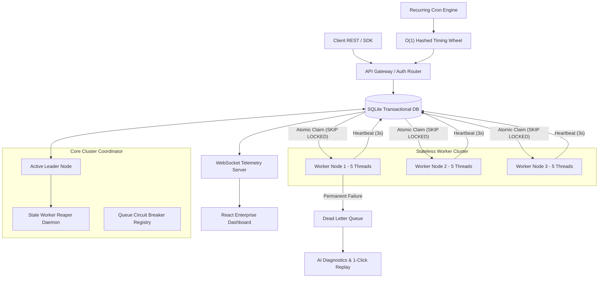

# ⚡ ApexQueue — Enterprise Distributed Job & Workflow Scheduler Engine

<div align="center">

[](https://distributed-job-scheduler-4a2p.onrender.com)
[](https://github.com/Lakshman2405/distributed-job-scheduler)
[](https://www.typescriptlang.org/)
[](https://nodejs.org/)
[](https://react.dev/)
[](https://vitest.dev/)

*A production-inspired, fault-tolerant distributed job scheduling and DAG workflow orchestration platform designed for extreme reliability, lock-free worker concurrency, and live observability.*

</div>

---

> [!IMPORTANT]
> **Live Production Deployment**:  
> Experience the running system live at **[https://distributed-job-scheduler-4a2p.onrender.com](https://distributed-job-scheduler-4a2p.onrender.com)**.  
> Access real-time job execution throughput, trigger Chaos Engineering experiments, inspect streaming terminal logs, and test AI-assisted root cause failure analysis.

---

## 🌟 Key Platform Highlights

- **🔒 Lock-Free Atomic Job Claiming**: Uses atomic transactions (`SKIP LOCKED` / row-level locks) preventing duplicate job execution across concurrent worker processes.
- **⏱️ O(1) Hashed Timing Wheel**: Sub-second precision scheduler indexing delayed and cron jobs into 60-slot timing wheels without database polling overhead.
- **👑 Active-Passive Leader Coordinator**: Raft-inspired lease-lock coordinator (`LeaderElectionService`) ensuring single-leader execution during multi-node scale-out.
- **⚡ Circuit Breaker Queue Protection**: Automatically trips queue execution to `OPEN` state if error rates exceed 50%, isolating downstream database outages.
- **🔀 Multi-Step DAG Workflow Orchestration**: Visual dependency graph pipeline solver executing root nodes and downstream steps with topological join resolution (`ALL_SUCCESS` / `ANY_SUCCESS`).
- **🤖 AI-Generated Root-Cause Diagnostics**: Automated LLM stack-trace diagnostic analyzer providing structured root cause breakdowns and 1-click patched job replays.
- **🔥 Chaos Engineering Resilience Lab**: Fault injector testing worker process crashes, network latency spikes, and poison-pill job escalation live.
- **🌐 Real-Time Telemetry & Log Streaming**: WebSocket pub/sub server broadcasting live throughput graphs and streaming terminal execution logs (`ws://localhost:4000/ws/telemetry`).
- **⌨️ Command Palette (`Ctrl+K` / `Cmd+K`)**: Keyboard-driven quick-launcher for instant feature navigation, chaos experiments, and API key management.

---

## 🏗️ System Architecture Overview

<div align="center">
  
</div>



---

## 📊 Database Schema (14 Normalized Entities)

ApexQueue implements an efficient, normalized relational schema:

| Table Name | Description | Key Indexes / Constraints |
| :--- | :--- | :--- |
| `organizations` | Multi-tenant organization accounts | `PRIMARY KEY (id)`, `UNIQUE (slug)` |
| `users` | User credentials & RBAC roles | `FOREIGN KEY (org_id)`, `UNIQUE (email)` |
| `projects` | Tenant workspace projects | `FOREIGN KEY (org_id)`, `UNIQUE (api_key)` |
| `worker_pools` | Capability tag router pools | `FOREIGN KEY (project_id)` |
| `retry_policies` | Backoff policies (Fixed, Linear, Exp Jitter) | `PRIMARY KEY (id)` |
| `queues` | Partition queues with concurrency/rate limits | `FOREIGN KEY (project_id)` |
| `workflows` | Multi-step DAG workflow definitions | `FOREIGN KEY (project_id)` |
| `workflow_nodes` | Pipeline graph step nodes | `FOREIGN KEY (workflow_id)` |
| `jobs` | Core job records | `idx_jobs_claim (queue_id, status, run_at)` |
| `job_dependencies` | DAG step dependency graph links | `FOREIGN KEY (parent_job_id, child_job_id)` |
| `workers` | Worker node registry & heartbeats | `idx_workers_heartbeat (status, last_heartbeat_at)` |
| `worker_heartbeats` | CPU/RAM metric telemetry history | `FOREIGN KEY (worker_id)` |
| `job_executions` | Execution attempt logs & timing | `FOREIGN KEY (job_id, worker_id)` |
| `job_logs` | Structured execution log messages | `FOREIGN KEY (job_id, execution_id)` |
| `scheduled_jobs` | Cron recurrence timing state | `FOREIGN KEY (queue_id)` |
| `dead_letter_queue` | Poison-pill job vault & AI summary | `FOREIGN KEY (job_id, queue_id)` |

*See full details in [`docs/ER_DIAGRAM.md`](file:///c:/projects/distributed-job-scheduler/docs/ER_DIAGRAM.md).*

---

## 🚀 Quickstart & Local Setup

### Prerequisites
- **Node.js**: v18.0.0 or higher
- **npm**: v9.0.0 or higher

### 1. Clone & Install Dependencies
```bash
git clone https://github.com/Lakshman2405/distributed-job-scheduler.git
cd distributed-job-scheduler
npm install
```

### 2. Run In Development Mode
```bash
npm run dev
```
- **React Frontend**: [http://localhost:3000](http://localhost:3000)
- **Express Backend REST API**: [http://localhost:4000/api/v1](http://localhost:4000/api/v1)
- **Prometheus Metrics**: [http://localhost:4000/metrics](http://localhost:4000/metrics)
- **WebSocket Telemetry**: `ws://localhost:4000/ws/telemetry`

### 3. Run Automated Tests
```bash
npm test
```

### 4. Build Production Bundle
```bash
npm run build
npm start
```

---

## 📚 Complete Technical Documentation

- 📄 **[System Architecture Spec](file:///c:/projects/distributed-job-scheduler/docs/ARCHITECTURE.md)**: Concurrency model, timing wheels, and worker daemons.
- 📄 **[Relational ER Diagram](file:///c:/projects/distributed-job-scheduler/docs/ER_DIAGRAM.md)**: Entity specifications, foreign keys, and indexes.
- 📄 **[REST & WebSocket API Guide](file:///c:/projects/distributed-job-scheduler/docs/API_DOCUMENTATION.md)**: Endpoints, authentication, and live streaming payloads.
- 📄 **[Design Decisions & Trade-Offs](file:///c:/projects/distributed-job-scheduler/docs/DESIGN_DECISIONS.md)**: Architecture trade-offs and rationale.
- 📄 **[Software Engineering & SOLID Patterns](file:///c:/projects/distributed-job-scheduler/docs/SOFTWARE_ENGINEERING_PATTERNS.md)**: SOLID principles, Strategy, Repository, & Circuit Breaker patterns.

---

## 📜 License

Distributed under the MIT License. See `LICENSE` for details.
