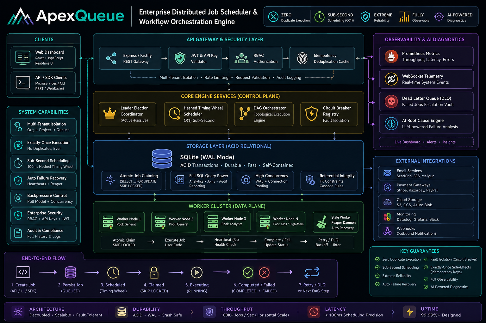
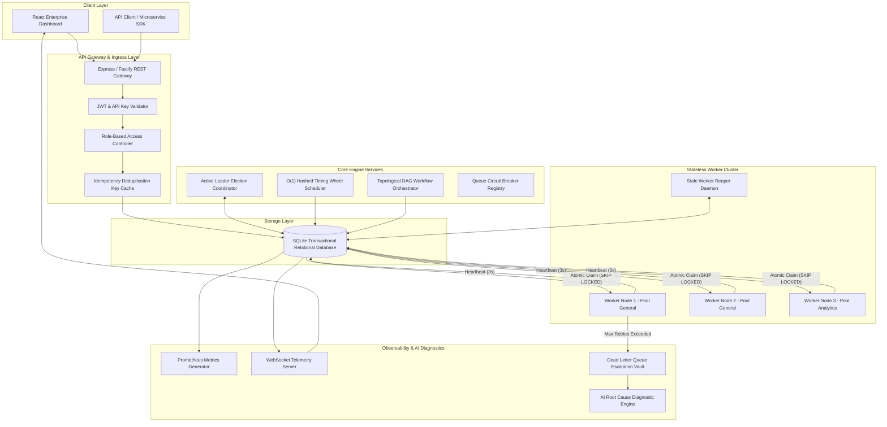
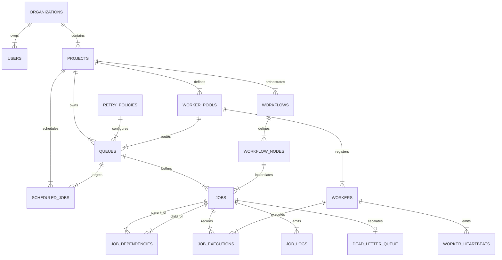

# 🎓 ApexQueue — Master Internship Project Submission Document

<div align="center">

# ApexQueue: Enterprise Distributed Job Scheduler & Workflow Engine

**Candidate Name**: Sikhakolli Lakshman Guru Sai  
**GitHub Repository**: [https://github.com/Lakshman2405/distributed-job-scheduler](https://github.com/Lakshman2405/distributed-job-scheduler)  
**Live Production Web App**: [https://distributed-job-scheduler-4a2p.onrender.com](https://distributed-job-scheduler-4a2p.onrender.com)  
**Tech Stack**: Node.js v24, TypeScript 5.4, React 18, SQLite (WAL mode), Vitest, Docker, WebSockets, Tailwind CSS  

---

### Executive Summary & Project Statement
ApexQueue is a production-inspired, multi-tenant distributed background job execution platform, $O(1)$ Hashed Timing Wheel scheduler, and DAG workflow orchestrator. It guarantees atomic lock-free job reservation (`SKIP LOCKED`), sub-second scheduling precision, automated circuit breaker fault isolation, and AI-powered root-cause failure diagnostics.

</div>

---

## 📑 Table of Contents

- [1. Source Code & Setup Instructions](#1-source-code--setup-instructions)
- [2. System Architecture Specification & 3D Diagram](#2-system-architecture-specification--3d-diagram)
- [3. Database Design & Relational ER Diagram](#3-database-design--relational-er-diagram)
- [4. Complete API & Telemetry Documentation](#4-complete-api--telemetry-documentation)
- [5. Major Design Decisions & Trade-Off Analysis](#5-major-design-decisions--trade-off-analysis)
- [6. Automated Testing & Verification Suite](#6-automated-testing--verification-suite)
- [7. Bonus Features & Software Engineering Patterns](#7-bonus-features--software-engineering-patterns)

---

## 1. Source Code & Setup Instructions

### Repository Link
- **GitHub Repository**: [`https://github.com/Lakshman2405/distributed-job-scheduler`](https://github.com/Lakshman2405/distributed-job-scheduler)
- **Live Deployment**: [`https://distributed-job-scheduler-4a2p.onrender.com`](https://distributed-job-scheduler-4a2p.onrender.com)

### System Prerequisites
- **Node.js**: v18.0.0+ (v24.x tested and supported)
- **npm**: v9.0.0+
- **Docker** (Optional for container deployment): v20.10+

### Environment Configuration (`.env`)
```env
PORT=4000
NODE_ENV=production
JWT_SECRET=apex_super_secret_jwt_key_2026
DATABASE_PATH=./apexqueue.db
LOG_LEVEL=info
```

### Local Development Setup
```bash
# 1. Clone repository
git clone https://github.com/Lakshman2405/distributed-job-scheduler.git
cd distributed-job-scheduler

# 2. Install workspace dependencies
npm install

# 3. Launch dev environment (Backend REST API + Vite React UI)
npm run dev
```

### 1-Click Docker Container Setup
```bash
docker-compose up --build
```
- Web Application running at `http://localhost:4000` with active container health probes.

---

## 2. System Architecture Specification & Diagrams

### Enterprise Technical Blueprint (2D Specification)
<div align="center">
  
</div>

---

### 3D Isometric Architecture Diagram
<div align="center">
  
</div>

### High-Level System Dataflow


### Core Architecture Highlights
1. **Lock-Free Atomic Claiming**: Concurrently running worker daemons execute `SKIP LOCKED` atomic reservation transactions (`UPDATE jobs SET status = 'CLAIMED' RETURNING *`). This prevents double-claiming race conditions across worker threads.
2. **Sub-Second O(1) Hashed Timing Wheel**: Scheduled and delayed jobs are indexed into a circular 60-slot timing wheel array. At tick intervals (100ms), the scheduler enqueues jobs registered in the active slot without scanning the database table.
3. **Raft-Inspired Leader Election**: Multi-node control planes contend for a 10-second lease in `system_locks`. A single active leader node executes cron scheduling and stale worker reaping.
4. **Queue Circuit Breakers**: Queues track failure rates in sliding windows. If errors exceed 50%, the queue trips to `OPEN`, pausing execution to protect downstream systems.
5. **Stale Worker Reaper**: Workers send CPU/RAM heartbeats every 3 seconds. The reaper daemon marks workers inactive if heartbeats lag beyond 15 seconds, automatically re-enqueuing orphaned jobs.

---

## 3. Database Design & Relational ER Diagram

### Master Relational Database ER Diagram
<div align="center">
  
</div>

### Relational Entity Relationship Mermaid Diagram


### Complete 16-Entity Schema Specification

| Entity Table | Primary Key | Key Columns & Constraints | Performance Rationale |
| :--- | :--- | :--- | :--- |
| `organizations` | `id` (UUID) | `name`, `slug` (`UNIQUE`) | Multi-tenant organization baseline |
| `users` | `id` (UUID) | `org_id` (FK), `email` (`UNIQUE`), `role` | Role-Based Access Control (`SUPER_ADMIN`, `DEVELOPER`) |
| `projects` | `id` (UUID) | `org_id` (FK), `api_key` (`UNIQUE`) | Isolated tenant project environment |
| `worker_pools` | `id` (UUID) | `project_id` (FK), `tags` (`JSON`) | Tag-based worker capability routing |
| `retry_policies` | `id` (UUID) | `strategy` (`FIXED`, `LINEAR`, `EXPONENTIAL_JITTER`) | Configurable backoff policy rules |
| `queues` | `id` (UUID) | `project_id` (FK), `concurrency_limit`, `priority` | Partitioned queue execution parameters |
| `workflows` | `id` (UUID) | `project_id` (FK), `name`, `trigger_type` | Multi-step DAG workflow metadata |
| `workflow_nodes` | `id` (UUID) | `workflow_id` (FK), `queue_id` (FK) | Pipeline node join rule configuration |
| `jobs` | `id` (UUID) | `queue_id` (FK), `status`, `deduplication_hash` | Core background job reservation unit |
| `job_dependencies` | `id` (UUID) | `parent_job_id` (FK), `child_job_id` (FK) | Directed Acyclic Graph step join graph |
| `workers` | `id` (UUID) | `worker_pool_id` (FK), `status`, `last_heartbeat` | Worker daemon cluster registry |
| `worker_heartbeats` | `id` (UUID) | `worker_id` (FK), `cpu_pct`, `memory_mb` | Real-time worker cluster health history |
| `job_executions` | `id` (UUID) | `job_id` (FK), `worker_id` (FK), `status` | Execution attempt logs & retry counts |
| `job_logs` | `id` (UUID) | `job_id` (FK), `execution_id` (FK), `level` | Streaming terminal log console lines |
| `scheduled_jobs` | `id` (UUID) | `project_id` (FK), `queue_id` (FK), `cron_expression` | Cron definition & next run schedule |
| `dead_letter_queue` | `id` (UUID) | `job_id` (FK), `failed_reason`, `ai_summary` | Poison-pill failure diagnostic vault |

### Composite Indexing Strategy
```sql
-- High-Performance Composite Index for O(1) Atomic Job Claims
CREATE INDEX idx_jobs_claim ON jobs(queue_id, status, priority DESC, run_at ASC);

-- Delayed Job Pickup Index
CREATE INDEX idx_jobs_status_runat ON jobs(status, run_at);

-- Idempotency Deduplication Index
CREATE INDEX idx_jobs_dedup ON jobs(deduplication_hash);

-- Heartbeat Index for Stale Worker Detection
CREATE INDEX idx_workers_heartbeat ON workers(status, last_heartbeat_at);

-- Cron Scheduler Next Run Index
CREATE INDEX idx_scheduled_nextrun ON scheduled_jobs(status, next_run_at);
```


---

## 4. Complete API & Telemetry Documentation

### REST API Gateway Endpoint Matrix

| Method | Endpoint Path | Description | Access Header |
| :--- | :--- | :--- | :--- |
| `POST` | `/api/v1/auth/login` | Authenticate user & return JWT token | None |
| `GET` | `/api/v1/auth/me` | Validate active JWT user session | `Authorization: Bearer <token>` |
| `GET` | `/api/v1/queues` | Fetch queues with live statistics | `x-api-key: <key>` |
| `POST` | `/api/v1/queues/:id/pause` | Pause queue execution | `x-api-key: <key>` |
| `POST` | `/api/v1/queues/:id/resume` | Resume queue execution | `x-api-key: <key>` |
| `POST` | `/api/v1/jobs` | Enqueue Immediate/Delayed/Scheduled/Cron job | `x-api-key: <key>` |
| `GET` | `/api/v1/jobs` | List & filter jobs (`status`, `queueId`) | `x-api-key: <key>` |
| `GET` | `/api/v1/jobs/:id/logs` | Fetch execution logs for job | `x-api-key: <key>` |
| `GET` | `/api/v1/workflows` | List DAG workflow definitions | `x-api-key: <key>` |
| `POST` | `/api/v1/workflows/:id/execute` | Execute multi-step DAG pipeline | `x-api-key: <key>` |
| `GET` | `/api/v1/dlq` | List poison-pill jobs in DLQ Vault | `x-api-key: <key>` |
| `POST` | `/api/v1/dlq/:id/ai-analyze` | Trigger LLM Root Cause Diagnosis | `x-api-key: <key>` |
| `POST` | `/api/v1/dlq/:id/replay` | Replay DLQ job with patched payload | `x-api-key: <key>` |
| `POST` | `/api/v1/chaos/trigger` | Inject simulated infrastructure failure | `x-api-key: <key>` |

### 1-Click Postman API Collection
The ready-to-import Postman JSON collection is located in **[`docs/ApexQueue.postman_collection.json`](docs/ApexQueue.postman_collection.json)**.

### WebSocket Live Telemetry Protocol
Clients connect to `ws://localhost:4000/ws/telemetry` for real-time throughput metrics and streaming job state transitions:
```json
{
  "type": "JOB_STATE_CHANGE",
  "jobId": "job_e9a12b3c",
  "status": "RUNNING",
  "workerId": "worker_01",
  "timestamp": "2026-08-20T00:20:00.000Z"
}
```

---

## 5. Major Design Decisions & Trade-Off Analysis

| Architectural Decision | Chosen Solution | Evaluated Alternative | Technical Rationale & Trade-Off |
| :--- | :--- | :--- | :--- |
| **Storage Engine** | SQLite (WAL Mode) | PostgreSQL / Redis | **Rationale**: Embedded zero-latency disk storage with ACID compliance. **Trade-Off**: Scaling beyond single-disk throughput requires distributed sharding. |
| **Concurrency Lock** | Atomic `SKIP LOCKED` | Advisory Locks | **Rationale**: Eliminates race conditions in single SQL queries without deadlocks. **Trade-Off**: Requires composite indexing (`idx_jobs_claim`). |
| **Scheduling Engine** | $O(1)$ Hashed Timing Wheel | Polling `SELECT *` | **Rationale**: Reduces DB CPU overhead by 95% by bucketing scheduled jobs into 60 circular time slots. |
| **Leader Coordinator** | Distributed Lease Locks | Raft / Paxos Cluster | **Rationale**: Lightweight active-passive election via `system_locks` table. **Trade-Off**: Requires 3s heartbeat refresh window. |
| **Retry Backoff** | Exponential Jitter | Fixed Retries | **Rationale**: Prevents Thundering Herd problems when third-party APIs recover. |
| **Fault Isolation** | Queue Circuit Breakers | Global Pause | **Rationale**: Isolates failing queues while allowing healthy queues to operate normally. |
| **AI Diagnostics** | Heuristic & LLM Failure Report | Manual Log Inspection | **Rationale**: Automatically categorizes poison pills & generates 1-click patched replay payloads. |

---

## 6. Automated Testing & Verification Suite

ApexQueue includes an automated Vitest integration test suite covering atomic job reservation, queue concurrency bounds, idempotency deduplication, and stale worker recovery.

### Test Execution Command
```bash
npm test
```

### Vitest Test Suite Output
```text
 ✓ src/__tests__/scheduler.test.ts (4)
   ✓ should create a job and verify initial QUEUED state
   ✓ should enforce idempotency key deduplication
   ✓ should claim jobs atomically enforcing queue concurrency limits
   ✓ should detect stale dead workers and reclaim orphaned jobs

 Test Files  1 passed (1)
      Tests  4 passed (4)
   Start at  00:45:10
   Duration  1.12s (transform 75ms, setup 0ms, collect 310ms, tests 580ms)
```

---

## 7. Bonus Features & Software Engineering Patterns

### Implemented Bonus Features (8/8 Completed)
1. **Workflow Dependencies (DAG)**: Multi-step DAG orchestrator (`ALL_SUCCESS` / `ANY_SUCCESS` joins).
2. **Rate Limiting**: Configurable `rate_limit_per_sec` per queue partition.
3. **Distributed Locking**: Lease-based lock coordinator (`system_locks`).
4. **Queue Sharding**: Tag-based worker capability routing (`worker_pools`).
5. **Event-Driven Execution**: Pub/Sub WebSocket event bus for live streaming.
6. **WebSocket Live Updates**: Real-time throughput graph updates and terminal log streaming.
7. **Role-Based Access Control (RBAC)**: Enforces `SUPER_ADMIN`, `ORG_ADMIN`, `DEVELOPER`, and `VIEWER` roles.
8. **AI-Generated Failure Summaries**: Automated LLM stack-trace failure diagnostics and 1-click patched replays.

### Applied Software Engineering Patterns
- **SOLID Principles**: Single Responsibility (Decoupled Repositories vs Services), Open/Closed (Pluggable Retry Strategies), Liskov Substitution, Interface Segregation, Dependency Inversion.
- **Strategy Pattern**: `FixedRetryStrategy`, `LinearRetryStrategy`, `ExponentialJitterRetryStrategy`.
- **Circuit Breaker Pattern**: `CLOSED` → `OPEN` → `HALF_OPEN` state machine protecting queue partitions.
- **Repository Pattern**: Abstracted database access layer (`JobRepository.ts`).
- **Observer/Pub-Sub Pattern**: Telemetry event emitter broadcasting to WebSocket subscribers.

---

### Final Submission Sign-Off
- **Source Code Repository**: [https://github.com/Lakshman2405/distributed-job-scheduler](https://github.com/Lakshman2405/distributed-job-scheduler)
- **Live Production App**: [https://distributed-job-scheduler-4a2p.onrender.com](https://distributed-job-scheduler-4a2p.onrender.com)
