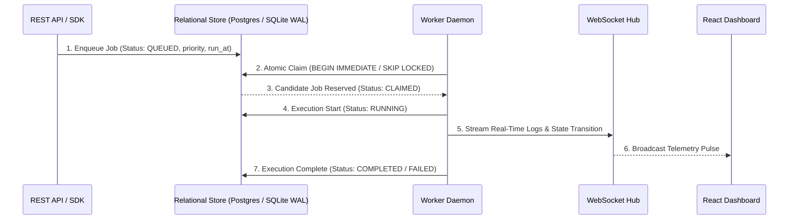
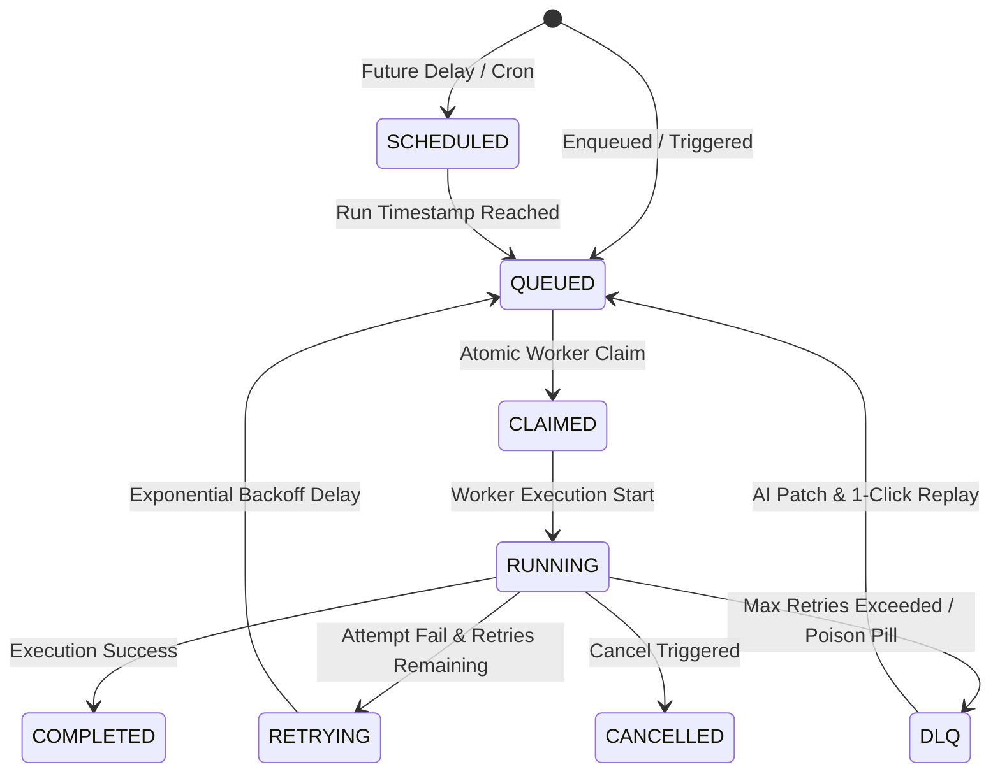

# ApexQueue System Architecture Documentation

## 1. High-Level Component Topology

ApexQueue separates concerns into a **Control Plane** (REST API Gateway, Leader Election Coordinator, Hashed Timing Wheel Scheduler, WebSocket Telemetry Hub) and a **Worker Execution Cluster** (Stateless Worker Daemons, Atomic Job Claiming Engine, Sandbox Executors, Stale Worker Reapers).

---

## 2. Job Lifecycle State Machine

