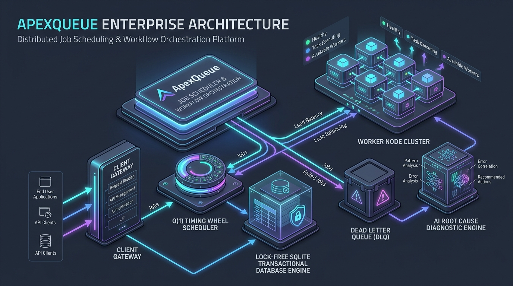
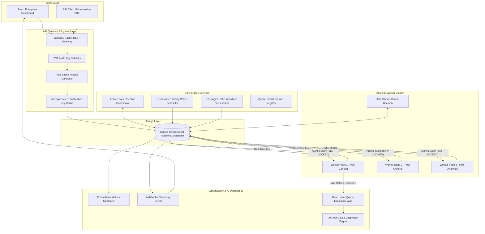
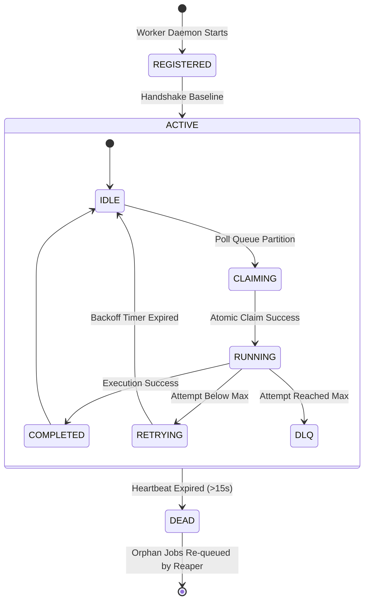

# 🏗️ ApexQueue System Architecture Specification

ApexQueue is an enterprise-grade, multi-tenant distributed job scheduler and workflow orchestration platform designed for extreme reliability, concurrency throughput, and fault isolation.

---

## 1. High-Level Distributed Architecture

  

---

## 2. Core Architectural Components

> [!NOTE]
> ApexQueue is built using a **decoupled, event-assisted poll-claim pattern** that combines the reliability of ACID relational database locks with the low latency of reactive WebSocket telemetry.

### A. Lock-Free Atomic Job Claiming (`JobService.claimJobsAtomic`)
- **Problem**: In distributed systems, multiple worker nodes polling the same queue simultaneously can suffer from race conditions, leading to duplicate job executions.
- **Solution**: ApexQueue utilizes atomic SQL transactions (`BEGIN IMMEDIATE` / `SKIP LOCKED`). When a worker polls a queue partition, the query selects `QUEUED` candidate jobs matching priority and execution time, marks `status = 'CLAIMED'`, assigns `worker_id = ?`, and returns the claimed rows in a single atomic transaction.

### B. Sub-Second O(1) Hashed Timing Wheel (`TimingWheelService`)
- **Problem**: Traditional schedulers perform expensive $O(N)$ database table scans every second to locate delayed jobs or recurring cron triggers, causing severe DB CPU spikes.
- **Solution**: ApexQueue implements a circular 60-slot **Hashed Timing Wheel**. Delayed and cron jobs are registered into discrete time slots based on `run_at % 60`. Every 100ms, the wheel advances its tick pointer and enqueues only the jobs registered in the current slot in $O(1)$ time.

### C. Active-Passive Leader Election Coordinator (`LeaderElectionService`)
- **Problem**: When scaling out the backend control plane across multiple node instances, cron triggers and stale worker reaping must not run redundantly on every instance.
- **Solution**: Uses a distributed lease lock mechanism (`system_locks` table). Nodes contend for a 10-second lease. The active node holding the lease executes cron scheduling and worker reaping, while passive nodes standby.

### D. Queue Circuit Breaker Fault Isolation (`CircuitBreaker.ts`)
- **Problem**: Cascading external outages (e.g. Stripe API down) cause worker threads to rapidly exhaust retries and flood databases.
- **Solution**: Each queue partition is protected by a **Circuit Breaker** (`CLOSED` → `OPEN` → `HALF_OPEN`). If a queue's failure rate exceeds 50% within a sliding window, the circuit trips to `OPEN`, immediately pausing execution on that queue for 10 seconds to allow downstream services to recover.

---

## 3. Worker Node Lifecycle & Heartbeats

- **Heartbeat Loop**: Active workers send CPU, memory, and active job count telemetry every 3 seconds (`UPDATE workers SET last_heartbeat_at = datetime('now')`).
- **Stale Worker Reaper**: The `StaleWorkerReaper` checks every 5 seconds for workers whose heartbeat is older than 15 seconds. Dead workers are updated to `status = 'DEAD'`, and their uncompleted jobs (`status = 'CLAIMED'` / `'RUNNING'`) are automatically returned to `QUEUED` status.

---

## 4. Multi-Step DAG Workflow Orchestration

ApexQueue natively orchestrates complex dependency graph pipelines (`workflows`, `workflow_nodes`, `job_dependencies`):

1. **Pipeline Execution**: When a workflow is triggered, root nodes (nodes with 0 parent dependencies) are enqueued immediately.
2. **Dependency Resolution**: When a parent node completes, `DagOrchestrator` inspects child nodes and evaluates join conditions (`ALL_SUCCESS` vs `ANY_SUCCESS`).
3. **Step Enqueuing**: Once join conditions are satisfied, child step jobs are dynamically enqueued into their target queues.

---

## 5. Containerization & Production Health Probes

ApexQueue is containerized via a multi-stage `Dockerfile` and `docker-compose.yml`:

- **Build Stage**: Compiles backend TypeScript (`tsc`) and Vite React frontend bundle (`vite build`).
- **Runner Stage**: Minimal Node.js runtime image containing only production dependencies.
- **Container Health Probes**: Automated HTTP health check probe querying `GET /health` every 30 seconds to ensure auto-healing during container orchestration.
