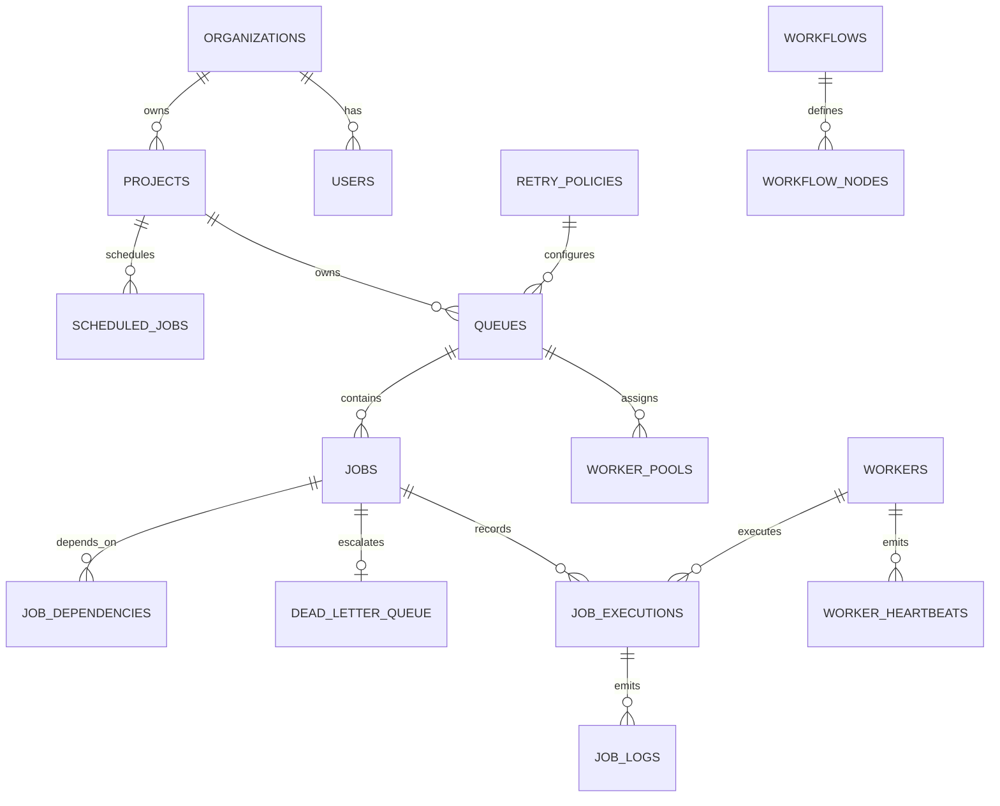

# ApexQueue Database ER Diagram & Schema Specification

## Schema Entities Summary (14 Entities)
1. **`organizations`**: Tenant container for users & projects.
2. **`users`**: Auth accounts with role-based access control (`SUPER_ADMIN`, `ORG_ADMIN`, `DEVELOPER`, `VIEWER`).
3. **`projects`**: Isolated environment owning queues, workflows, and API keys.
4. **`worker_pools`**: Resource tag capabilities mapping queues to specific worker clusters.
5. **`retry_policies`**: Configurable backoff algorithms (`FIXED`, `LINEAR`, `EXPONENTIAL_JITTER`).
6. **`queues`**: Priority partitions with concurrency limits and status states (`ACTIVE`, `PAUSED`, `DRAINING`).
7. **`workflows`**: DAG pipeline definitions.
8. **`workflow_nodes`**: Pipeline steps with parent dependency arrays and join rules (`ALL_SUCCESS`, `ANY_SUCCESS`).
9. **`jobs`**: Central job entity with payload, status state machine, priority, run_at, timeout, and idempotency key.
10. **`job_dependencies`**: Runtime parent-child state resolution.
11. **`workers`**: Registered worker nodes with heartbeat timestamps.
12. **`worker_heartbeats`**: CPU/RAM utilization telemetry logs.
13. **`job_executions`**: Per-attempt execution log with runtime timings and stack traces.
14. **`job_logs`**: Console stdout/stderr log stream per job attempt.
15. **`scheduled_jobs`**: Cron expression definitions.
16. **`dead_letter_queue`**: Permanent failures with AI root cause reports and patched payloads.
