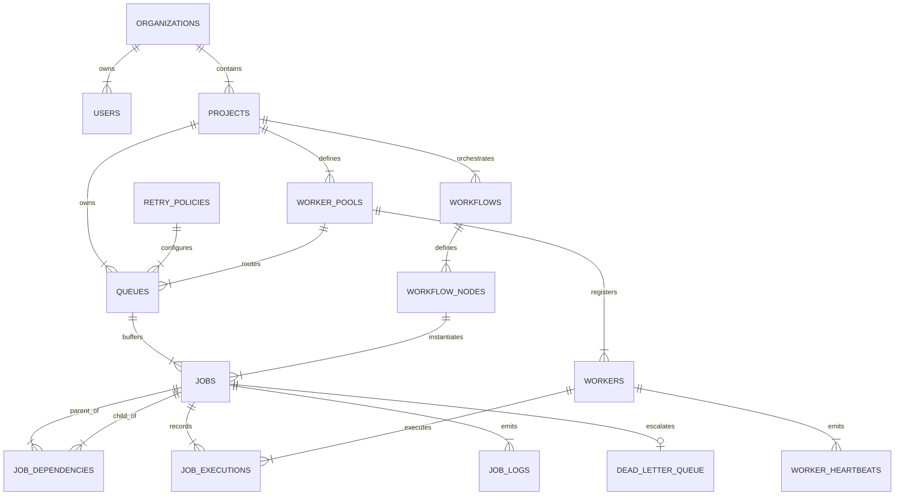

# 🗄️ ApexQueue Database Schema & ER Diagram Specification

ApexQueue uses a fully normalized, high-performance relational database schema designed for multi-tenancy, transactional job claiming, and auditability.

---

## 1. Entity Relationship Diagram (ERD)



---

## 2. Table Specifications (14 Entities)

> [!TIP]
> All primary keys use collision-resistant UUID strings (`uuidv4()`). All foreign key relationships enforce referential integrity with cascading behavior (`ON DELETE CASCADE`).

### 1. `organizations`
Multi-tenant organizational boundary accounts.
- `id` (VARCHAR 36, PRIMARY KEY)
- `name` (VARCHAR 255, NOT NULL)
- `slug` (VARCHAR 255, UNIQUE, NOT NULL)
- `created_at` (DATETIME, DEFAULT CURRENT_TIMESTAMP)

### 2. `users`
Authenticated user accounts with Role-Based Access Control (RBAC).
- `id` (VARCHAR 36, PRIMARY KEY)
- `org_id` (VARCHAR 36, FK -> `organizations.id` ON DELETE CASCADE)
- `email` (VARCHAR 255, UNIQUE, NOT NULL)
- `password_hash` (VARCHAR 255, NOT NULL)
- `role` (VARCHAR 50, DEFAULT 'DEVELOPER') — Options: `SUPER_ADMIN`, `ORG_ADMIN`, `DEVELOPER`, `VIEWER`
- `created_at` (DATETIME, DEFAULT CURRENT_TIMESTAMP)

### 3. `projects`
Isolated tenant project environments.
- `id` (VARCHAR 36, PRIMARY KEY)
- `org_id` (VARCHAR 36, FK -> `organizations.id` ON DELETE CASCADE)
- `name` (VARCHAR 255, NOT NULL)
- `api_key` (VARCHAR 255, UNIQUE, NOT NULL)
- `created_at` (DATETIME, DEFAULT CURRENT_TIMESTAMP)

### 4. `worker_pools`
Worker node routing pools based on capability tags (`general`, `gpu`, `high-mem`).
- `id` (VARCHAR 36, PRIMARY KEY)
- `project_id` (VARCHAR 36, FK -> `projects.id` ON DELETE CASCADE)
- `name` (VARCHAR 255, NOT NULL)
- `capability_tags` (TEXT) — JSON array of capability tags
- `created_at` (DATETIME, DEFAULT CURRENT_TIMESTAMP)

### 5. `retry_policies`
Configurable backoff retry algorithms.
- `id` (VARCHAR 36, PRIMARY KEY)
- `name` (VARCHAR 255, NOT NULL)
- `strategy` (VARCHAR 50, NOT NULL) — Options: `FIXED`, `LINEAR`, `EXPONENTIAL_JITTER`
- `base_delay_ms` (INTEGER, DEFAULT 1000)
- `max_delay_ms` (INTEGER, DEFAULT 60000)
- `max_attempts` (INTEGER, DEFAULT 3)

### 6. `queues`
Partition queue configurations with concurrency and rate limits.
- `id` (VARCHAR 36, PRIMARY KEY)
- `project_id` (VARCHAR 36, FK -> `projects.id` ON DELETE CASCADE)
- `worker_pool_id` (VARCHAR 36, FK -> `worker_pools.id`)
- `retry_policy_id` (VARCHAR 36, FK -> `retry_policies.id`)
- `name` (VARCHAR 255, NOT NULL)
- `priority` (INTEGER, DEFAULT 5) — Priority scale 1 (lowest) to 10 (highest)
- `concurrency_limit` (INTEGER, DEFAULT 10)
- `rate_limit_per_sec` (INTEGER, DEFAULT 100)
- `status` (VARCHAR 50, DEFAULT 'ACTIVE') — Options: `ACTIVE`, `PAUSED`, `DRAINING`
- `created_at` (DATETIME, DEFAULT CURRENT_TIMESTAMP)

### 7. `workflows` & 8. `workflow_nodes`
Multi-step DAG workflow pipeline definitions and step node templates.

### 9. `jobs`
Core job execution record.
- `id` (VARCHAR 36, PRIMARY KEY)
- `queue_id` (VARCHAR 36, FK -> `queues.id` ON DELETE CASCADE)
- `project_id` (VARCHAR 36, FK -> `projects.id` ON DELETE CASCADE)
- `workflow_execution_id` (VARCHAR 36)
- `workflow_node_id` (VARCHAR 36)
- `type` (VARCHAR 50, NOT NULL) — Options: `IMMEDIATE`, `DELAYED`, `SCHEDULED`, `CRON`, `DAG_STEP`
- `payload` (TEXT, NOT NULL) — JSON payload data
- `result` (TEXT) — JSON result data
- `status` (VARCHAR 50, DEFAULT 'QUEUED') — Options: `QUEUED`, `SCHEDULED`, `CLAIMED`, `RUNNING`, `COMPLETED`, `FAILED`, `RETRYING`, `CANCELLED`, `DLQ`
- `priority` (INTEGER, DEFAULT 5)
- `run_at` (DATETIME, NOT NULL)
- `timeout_ms` (INTEGER, DEFAULT 30000)
- `attempt_count` (INTEGER, DEFAULT 0)
- `max_attempts` (INTEGER, DEFAULT 3)
- `deduplication_hash` (VARCHAR 64)
- `idempotency_key` (VARCHAR 255)
- `worker_id` (VARCHAR 36)
- `created_at` (DATETIME, DEFAULT CURRENT_TIMESTAMP)
- `updated_at` (DATETIME, DEFAULT CURRENT_TIMESTAMP)

### 10. `job_dependencies`
Topological DAG node dependency map.
- `parent_job_id` (VARCHAR 36, FK -> `jobs.id` ON DELETE CASCADE)
- `child_job_id` (VARCHAR 36, FK -> `jobs.id` ON DELETE CASCADE)
- PRIMARY KEY (`parent_job_id`, `child_job_id`)

### 11. `workers` & 12. `worker_heartbeats`
Worker process node cluster registry and CPU/RAM telemetry metrics.

### 13. `job_executions` & `job_logs`
Execution attempt history, durations, stack traces, and streaming terminal logs.

### 14. `dead_letter_queue`
Poison-pill failure vault with AI root cause summary and patched payload preview.

---

## 3. Database Indexes & Performance Optimization

```sql
-- High-Performance Composite Index for O(1) Atomic Job Claims
CREATE INDEX idx_jobs_claim ON jobs(queue_id, status, run_at, priority DESC);

-- Heartbeat Index for Stale Worker Detection
CREATE INDEX idx_workers_heartbeat ON workers(status, last_heartbeat_at);

-- Idempotency Deduplication Unique Index
CREATE UNIQUE INDEX idx_jobs_idempotency ON jobs(project_id, idempotency_key) WHERE idempotency_key IS NOT NULL;
```
