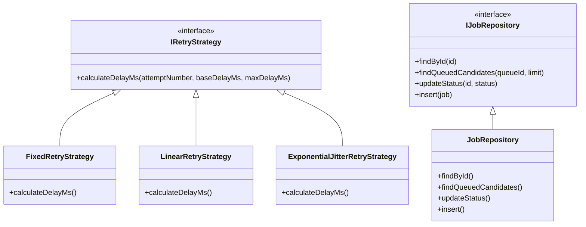

# 🏛️ ApexQueue Software Engineering Principles & Patterns Specification

ApexQueue strictly adheres to enterprise Software Engineering principles, SOLID design guidelines, and fault-tolerance patterns.

---

## 1. SOLID Principles Implementation

### A. Single Responsibility Principle (SRP)
- **Data Access Layer (`JobRepository.ts`, `QueueRepository.ts`)**: Encapsulates raw SQL queries and data mapping.
- **Service Domain Layer (`JobService.ts`, `QueueService.ts`)**: Encapsulates state machine transitions, dependency checks, and failure handling.
- **Presentation Layer (`apiRoutes.ts`)**: Encapsulates REST request validation, response formatting, and HTTP status codes.

### B. Open/Closed Principle (OCP)
- **Pluggable Strategy Pattern (`RetryStrategy.ts`)**:
  - The `IRetryStrategy` interface enables adding new backoff algorithms without altering core `JobService` execution code.

### C. Liskov Substitution Principle (LSP)
- All concrete retry implementations (`FixedRetryStrategy`, `LinearRetryStrategy`, `ExponentialJitterRetryStrategy`) can be substituted interchangeably through `IRetryStrategy` without breaking job retries.

### D. Interface Segregation Principle (ISP)
- Small, focused interfaces: `IRetryStrategy`, `IJobRepository`, `IWorkerDaemon`, `ITelemetryPublisher`.

### E. Dependency Inversion Principle (DIP)
- High-level orchestrators (`WorkerDaemon`) depend on storage and strategy abstractions rather than hardcoded query logic.

---

## 2. Design Patterns Applied

| Pattern Name | Location in Codebase | Architectural Purpose |
| :--- | :--- | :--- |
| **Strategy Pattern** | `src/patterns/strategies/RetryStrategy.ts` | Pluggable backoff retry algorithms. |
| **Circuit Breaker Pattern** | `src/patterns/circuitBreaker/CircuitBreaker.ts` | Trips execution when queue error rates spike (>50%). |
| **Repository Pattern** | `src/patterns/repositories/JobRepository.ts` | Decouples SQL database queries from business services. |
| **Active-Passive Leader Coordinator** | `src/services/LeaderElectionService.ts` | Distributed lease lock manager preventing multi-leader cron execution. |
| **Hashed Timing Wheel** | `src/services/TimingWheelService.ts` | $O(1)$ time-slot index engine for sub-second scheduling. |
| **Observer (Pub/Sub) Pattern** | `src/websocket/telemetryServer.ts` | Decouples worker daemons from real-time WebSocket dashboard broadcasts. |
| **Idempotency Key Pattern** | `src/services/JobService.ts` | Payload deduplication window preventing duplicate execution side-effects. |

---

## 3. Resilience & Fault Isolation Patterns

> [!IMPORTANT]
> **Bulkhead Isolation**: Worker thread pools (`pool_general` vs `pool_gpu`) isolate heavy background execution workloads so high-memory tasks never starve real-time queues.
